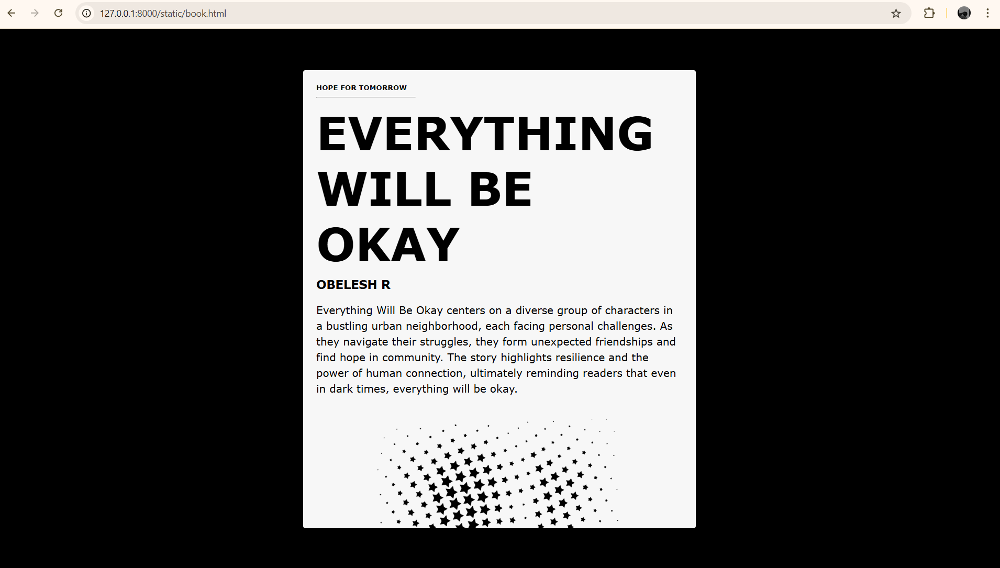

# Ex.06 Book Front Cover Page Design
# Date:
# AIM:
To design a book front cover page using HTML and CSS.

# DESIGN STEPS:
## Step 1:
Create a Django Admin project.

## Step 2:
Create an app in the Django interface.

## Step 3:
Create a folder named 'static' in the app folder.

## Step 4:
Create a new HTML file in the static folder.

## Step 5:
Write the HTML code with relevant CSS properties.

## Step 6:
Choose the appropriate style and color scheme.

## Step 7:
Insert the images in their appropriate places.

## Step 8:
Publish the website in the LocalHost.

# PROGRAM:
```
<!DOCTYPE html>
<html lang="en">
<head>
    <meta charset="UTF-8">
    <meta name="viewport" content="width=device-width, initial-scale=1.0">
    <title>Book-like Section</title>
    <style>
        body {
            font-family: 'Georgia', serif;
            background-color: #000000;
            display: flex;
            justify-content: center;
            align-items: center;
            height: 100vh;
            margin: 0;
        }

        .book {
            width: 600px;
            height: 700px;
            font-family: Verdana, Geneva, Tahoma, sans-serif;
            background-color: #f7f7f7;
            border: 2px solid #000;
            border-radius: 5px;
            box-shadow: 0 0 10px rgba(0, 0, 0, 0.1);
            overflow: hidden;
            position: relative;
        }

        .page {
            padding: 20px;
            border-bottom: 1px solid #ccc;
            height: 100%;
            position: relative;
        }

        .page:last-child {
            border-bottom: none;
        }

        h1, h2 {
            margin: 0;
        }

        h1 {
            font-size: 70px;
            margin-bottom: 10px;
        }

        h2 {
            font-size: 18px;
            margin-bottom: 15px;
        }

        p {
            line-height: 1.5;
            border: 0;
            padding: 0;
        }

        h6 {
            margin: 0px;
            padding: 0px;
        }

        hr {
            width: 150px;
            float: left;
        }
    </style>
</head>
<body>
    <div class="book">
        <div class="page">
            <h6>HOPE FOR TOMORROW</h6>
            <hr>
            <br>
            <h1>EVERYTHING WILL BE OKAY</h1>
            <h2>OBELESH R</h2>
            <p>Everything Will Be Okay centers on a diverse group of characters in a bustling urban neighborhood, each facing personal challenges. As they navigate their struggles, they form unexpected friendships and find hope in community. The story highlights resilience and the power of human connection, ultimately reminding readers that even in dark times, everything will be okay.</p>
            <center>
                
            </center>
        </div>
        <div class="page">
            <h2>Chapter 1</h2>
            <p>Quisque volutpat condimentum velit. Class aptent taciti sociosqu ad litora torquent per conubia nostra, per inceptos himenaeos.</p>
        </div>
        <div class="page">
            <h2>Chapter 2</h2>
            <p>Nullam quis risus eget urna mollis ornare vel eu leo. Curabitur blandit tempus porttitor. Integer posuere erat a ante venenatis dapibus.</p>
        </div>
    </div>
</body>
</html>
```
# OUTPUT:


# RESULT:
The program for designing book front cover page using HTML and CSS is completed successfully.
